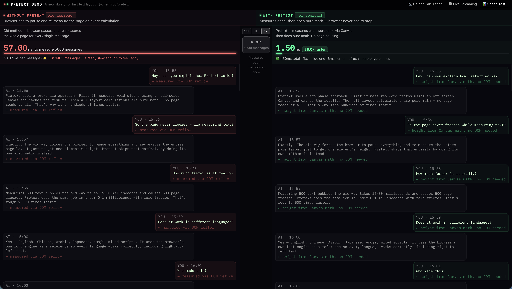

# Pretext Demo

[](https://github.com/leomacode/pretext-demo/actions/workflows/ci.yml)

**[Live Demo](https://pretext-demo-five.vercel.app/)**

A side-by-side interactive demo exploring [@chenglou/pretext](https://github.com/chenglou/pretext) — a new JS/TS library for DOM-free text measurement that went from 0 to 7,000 GitHub stars in days.

## What this demonstrates

Most chat apps need to know how tall each message is before rendering it.
The traditional approach asks the browser to measure each element via `getBoundingClientRect()`,
which forces a synchronous layout reflow — pausing the entire page each time.

Pretext solves this with a two-phase approach:

1. **prepare()** — measures word widths once via Canvas, caches at word level
2. **layout()** — pure arithmetic from that point on, zero DOM reads

## Three tabs

| Tab                   | What it shows                                                                                                        |
| --------------------- | -------------------------------------------------------------------------------------------------------------------- |
| 📐 Height Calculation | Press Load — left side measures messages one by one (watch the counter), right side calculates all heights instantly |
| 💬 Live Streaming     | Same text streamed simultaneously — left container jumps on every new line, right container is locked from the start |
| 📊 Speed Test         | Real benchmark — actual DOM nodes rendered and measured, compared against Pretext math                               |

## Benchmark Results

Measured in Chrome on MacBook Pro. Pretext column times the layout phase only
(prepare is amortized — that's the whole point of the two-phase API).

| Messages | DOM measure | Pretext | Speedup |
| -------: | ----------: | ------: | ------: |
|      100 |      3.9 ms |  0.1 ms |     39× |
|    1,000 |     26.1 ms |  0.5 ms |     52× |
|    5,000 |    121.1 ms |  2.3 ms |     53× |



## Technical highlights

- Shared `OffscreenCanvas` — one instance reused across all measurements
- Word-level width cache — shared vocabulary measured once across all messages
- `Float32Array` for height storage — less GC pressure
- `ResizeObserver` throttled with `requestAnimationFrame`

## Architecture

**One measurement surface.** `src/pretext.ts` wraps `@chenglou/pretext`
(`prepare` / `layout` / `clearCache`) plus a `domMeasureHeight` DOM helper, so
the whole app — and the tests — depend on a single stable boundary instead of
the library directly.

**The benchmark is the point, so it's measured honestly.** The two sides aren't
timed the same way on purpose — each reflects what production actually pays:

- _Pretext_ — `prepare()` runs once up front (amortized, as the two-phase API
  intends); only the `layout()` phase is timed, because that's the per-reflow
  cost a real app pays on every re-render.
- _DOM_ — each bubble is appended, read via `getBoundingClientRect()`, then
  removed. Interleaving a write with a read forces **one reflow per message** —
  the real "browser pauses on every message" cost. Appending all-then-reading
  would batch into a single reflow and undercount; reusing one growing
  container would make it O(n²) and freeze the tab.

**Height contract.** `layout()` returns the text height only; rendered bubbles
add `8px` top/bottom padding. So a predicted height is always `layout() + 16` —
encoded once in `useStream` and asserted by the browser cross-validation test.

**Component shape.** Tab components own the state machines (`idle → running →
done`); panes and bubbles are pure presentational components. The per-pane
accent color flows down as a `--c` CSS custom property, so one set of CSS
Module classes renders both the red ("without") and green ("with") columns.

**Tests mirror the split.** Pure logic and state machines run fast in
happy-dom; the one claim that needs a real layout engine — Pretext's math
equalling the browser's — runs in headless Chromium (see [Testing](#testing)).

For the reasoning and tradeoffs behind these choices — and what a production
version would do differently at scale — see [docs/DESIGN.md](docs/DESIGN.md).

## Stack

React 19 · TypeScript · Vite · Vitest · No UI libraries

## Run locally

```bash
npm install
npm run dev
```

## Testing

```bash
npm test           # unit project (happy-dom) — watch mode
npm test -- --run  # unit project, single run
npm run test:browser  # cross-validation in headless Chromium
npm run test:all      # both projects
```

29 tests across two Vitest projects:

- **unit** (happy-dom) — the `useStream` state machine and each tab's
  idle → running → done flow. A polyfilled `OffscreenCanvas` lets Pretext's
  Canvas measurement run in Node.
- **browser** (Playwright/Chromium) — cross-validates that Pretext's height
  math matches the real browser layout engine within ±2px of
  `getBoundingClientRect()`. This is the core correctness claim, so it runs
  against an actual layout engine rather than skipping.

## Why I built this

I built this to deeply understand Pretext's architecture after seeing it go viral.
The key insight: most AI chat apps batch streaming tokens specifically to hide layout instability.
Pretext removes the root cause, so you can render every token as it arrives
and still have a stable layout — a better user experience that most teams don't know is possible.

## What I Learned

- **Forced sync layout has a compounding cost.** Every `getBoundingClientRect()` call forces the browser to flush pending style/DOM mutations before returning a number. With 1000 messages, that's 1000 separate layout flushes — each pausing the main thread.
- **Canvas measurement is constant-time per unique word.** `ctx.measureText()` is fast, and a word-level cache means a 10,000-message conversation with shared vocabulary measures in roughly the time it takes to measure the unique words once.
- **Why streaming chat apps batch tokens.** Every new token triggers layout, layout is synchronous, so batching hides the resulting jank. Pretext removes the root cause, allowing per-token rendering with a stable layout.
- **`OffscreenCanvas` + `Float32Array` matter at scale.** Reusing one canvas across all measurements avoids GPU context churn. Typed-array storage for heights drops GC pressure to near-zero when streaming.

## When NOT to Use Pretext

- **Small message lists (< 100 messages).** DOM measurement is plenty fast. The engineering and bundle cost isn't justified.
- **Heavy font / style variance per message.** The word-level width cache assumes stable typography. If every message has different fonts or sizes, cache hit rate collapses and the Canvas measurement loses its advantage.
- **Right-to-left scripts or complex Unicode.** `ctx.measureText` doesn't handle bidirectional text or grapheme clustering (emoji ZWJ sequences, combining marks) the way the layout engine does. DOM still wins here.
- **Content that depends on dynamic container styles.** Pretext's `prepare()` phase locks assumptions about line-height, padding, and width. If those change at runtime, the cached layout is wrong.
